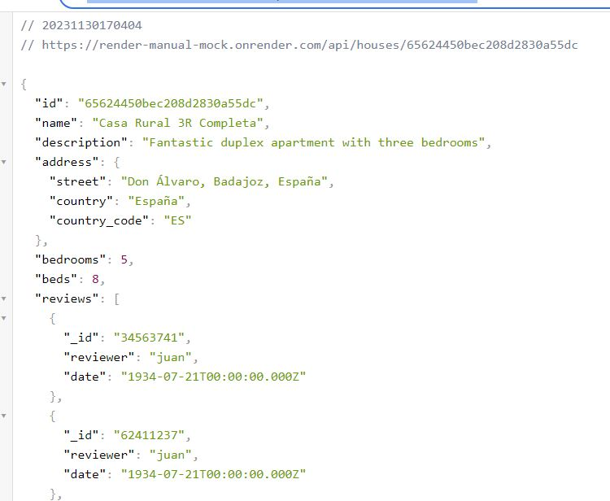
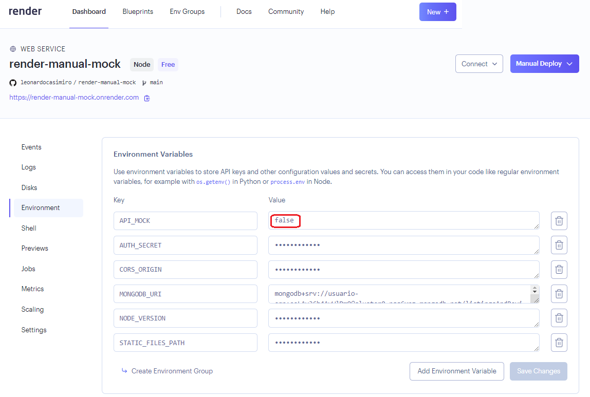
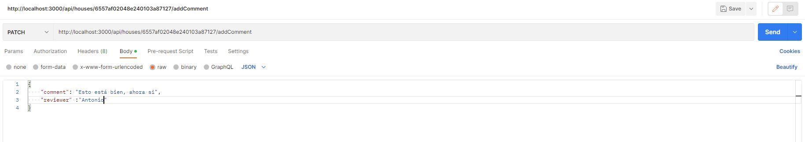

# Bootcamp Backend III - [Documental] Módulo 5 - Cloud – Laboratorio
## _render-manual-mock_
## Introducción

> Para esta práctica se sube a render la rest API de la practica anterior, la 4.
Para ello hemos hecho un repositorio "render-manual-mock". En este caso, modificando una variable de entorno, podemos pasar de datos mock a datos en mongo Atlas.

Mongo Atlas:

Repo:
- https://github.com/leonardocasimiro/render-manual-mock.

El enlace de render 
- https://render-manual-mock.onrender.com

Si se chequea el enlace de render, este tirará de los datos subidos en Mongo Atlas.

Si deseas ver datos mock, debes cambiar la variable de entorno en render

## Acciones

> Se crea en render un WEB SERVICE. Basado en Node. A este render se le indica el repo, region de alojamiento. Repositorio y rama de este.

Como comando de construccion se le indica:
- npm install

Comando start
- npm start

> Al subir el repo a gitHub como está sincronizado con este, render hara de forma automatica (se lo hemos indicado así) un Deploy.
Este deploy consiste en:
- Sincronizarse, de hecho es lo que activa el deploy
- REaliza un bulit con el comando que le hayamos pasado.
- y arranca la app con npm start

## end Points
Tiene los siguientes end points:

Get para consultar todos las casas

https://render-manual-mock.onrender.com/api/houses

Get para consultar por id

https://render-manual-mock.onrender.com/api/houses/65624450bec208d2830a55dc

Post para añadir una casa. Se puede usar postman agregando la casa en el body con   formatoJSON

http://localhost:3000/api/houses/

son los end points del modulo 4. Los no GET necesitamos postman …..

